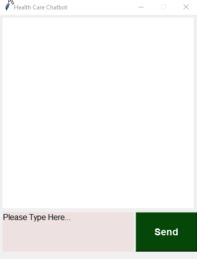

# Chatbot-Retrieval-Based-NLP


## Problem statement

The aim of this project is to create a chatbot for answering health related queries. It can answer questions regarding users health status.
It is based on rule-based keyword chatbots with ¨if/then¨ logic or we can say a retrival-based NLP chatbot using pythons NLTK tool-kit module and GUI is based on Tkinter.


• This repository consists of files required for end to end implementation of Retrieval Based Health Care Chatbot ___Natural Language Processing GUI___ created with ___Tkinter__.

## setup
- Clone the repository : https://github.com/ni3choudhary/abc.git
- Inside the project root directory, Create Python Virtual Environment and activate it using below commands 
```console
$ python3 -m venv env
``` 

Activate Virtual Environment
```console
$ .env/bin/activate 
          OR
$ .\env\Scripts\activate
```
Install Libraries using below command
```console
$ pip install -r requirements.txt
```
## The Files explained
Use the files as following to create the project from scratch or create your own project in an adapted way.

**1. data_preprocessing.py** to preprocess the data, tokenization, lemmatization of words and then will get pickled file for clean words, document and classes.

**2. train_bot.py** to train tensorflow model and save the model for gui building.

**3. app.py** to build a retrieval based chatbot using tkinter.

- Now run app.py on terminal.
```console
$ python app.py
```

## App Demo



• Please do ⭐ the repository, if it helped you in anyway.

